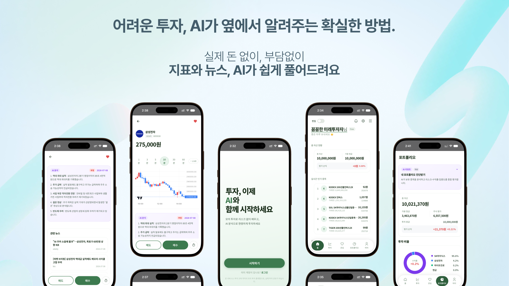
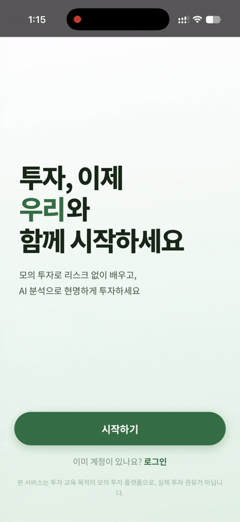
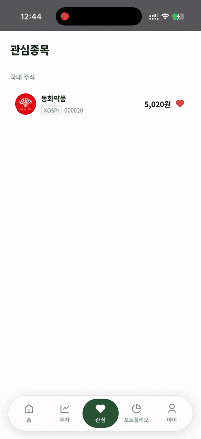
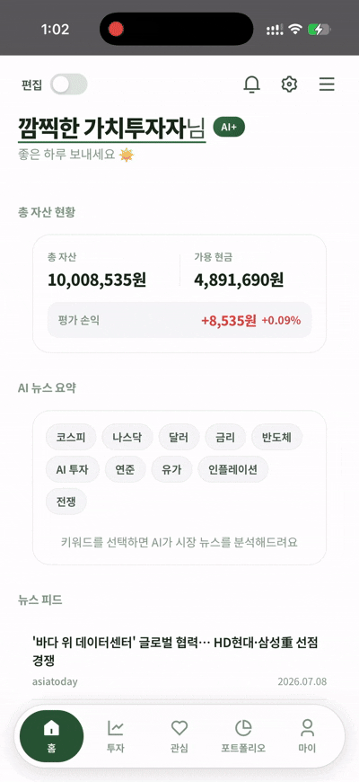
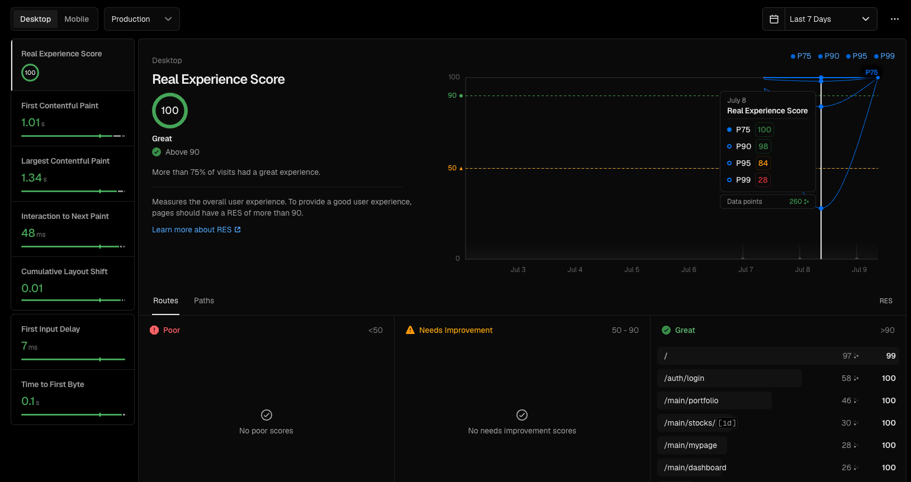
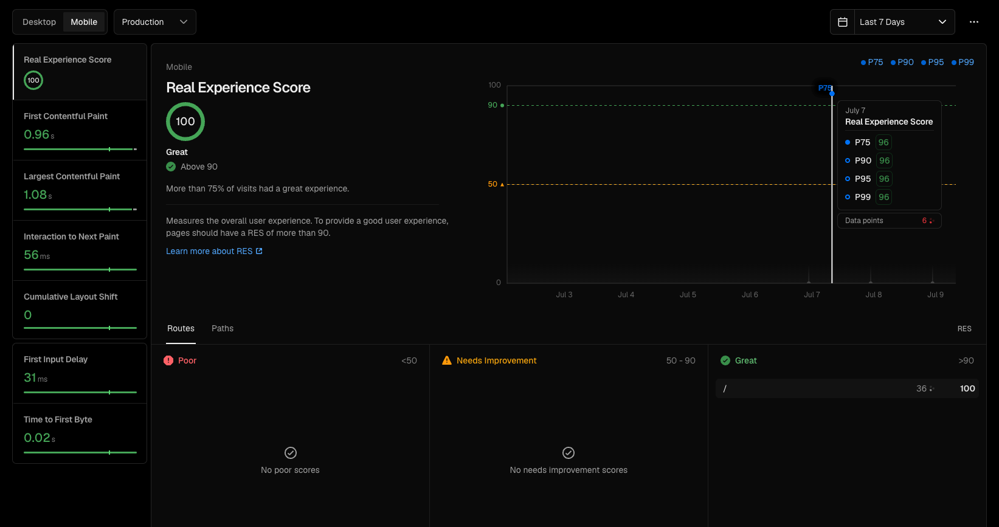

<!-- 상단 배너 이미지 교체 예정 -->
<div align="center">
  

  <h1>moni · 모니</h1>

[](https://www.moni.my)

  <p>초보 투자자를 위한 AI 기반 모의 투자 서비스 웹앱</p>

<p align="center">
  <a href="#프로젝트-소개">프로젝트 소개</a> &nbsp;&bull;&nbsp;
  <a href="#기술-스택">기술 스택</a> &nbsp;&bull;&nbsp;
  <a href="#프로젝트-구조">프로젝트 구조</a> &nbsp;&bull;&nbsp;
  <a href="#페이지별-기능">페이지별 기능</a> &nbsp;&bull;&nbsp;
  <a href="#성능">성능</a> &nbsp;&bull;&nbsp;
  <a href="#실행-방법">실행 방법</a> &nbsp;&bull;&nbsp;
  <a href="#컨벤션">컨벤션</a>
</p>

</div>


## 프로젝트 소개


복잡한 금융 정보를 AI로 쉽게 풀어주고, 실제 자금 없이 모의 매수·매도를 경험할 수 있는 **모의 투자 플랫폼**의 프론트엔드입니다.

- Next.js 16 App Router 기반 PWA — 홈 화면 추가 방식으로 모바일 앱처럼 사용
- FSD(Feature-Sliced Design) 아키텍처로 레이어 간 의존성 명확하게 분리
- OAuth 2.1 Authorization Code + PKCE 소셜 로그인 (Google · Kakao)
- lightweight-charts 기반 실시간 분봉 차트 (LIVE 10초 자동 갱신)
- AI 기업이슈 분석 · 시장 뉴스 요약 (RAG, 백엔드 ai-service 연동)
- Toss Payments SDK 기반 구독 결제


## 기술 스택


| 분류           | 기술                                                                                                                                                                                                                                                                                                           |
|:-------------|:-------------------------------------------------------------------------------------------------------------------------------------------------------------------------------------------------------------------------------------------------------------------------------------------------------------|
| Frontend     |    |
| Style        |                                                                                                                                                                                                    |
| Lint         |                                                                                                                                                                                                                  |
| Package      |                                                                                                                                                                                                                |
| Chart        |                                                                                                                                                                                                   |
| Payment      |                                                                                                                                                                                              |
| Architecture |                                                                                                                                                                                                                         |
| Platform     |                                                                                                                                                                                                                           |
| Deployment   |                                                                                                                                                                                                                  |


## 프로젝트 구조

FSD(Feature-Sliced Design) 레이어 구조를 따릅니다.

<details>
<summary>Directory Structure</summary>

```
src/
├── app/                              # Next.js App Router 페이지
│   ├── auth/
│   │   ├── login/                    # 로그인 (이메일 + OAuth)
│   │   ├── signup/                   # 회원가입 (3단계)
│   │   └── [provider]/callback/      # OAuth 콜백 (PKCE)
│   ├── main/
│   │   ├── dashboard/                # 홈 탭
│   │   ├── stocks/                   # 투자 탭 (목록 + 상세)
│   │   ├── portfolio/                # 포트폴리오 탭
│   │   ├── watchlist/                # 관심종목 탭
│   │   ├── notifications/            # 알림
│   │   └── mypage/                   # 마이 탭
│   │       ├── survey/               # 투자 성향 재설문
│   │       ├── profile/              # 프로필 편집
│   │       ├── settings/             # 앱 설정
│   │       ├── subscription/         # 구독/결제 관리
│   │       └── holdings/             # 보유 종목 · 거래 내역
│   └── payment/
│       ├── success/                  # 결제 성공 콜백
│       └── fail/                     # 결제 실패 콜백
│
├── widgets/
│   ├── bottom-nav/                   # 플로팅 알약 탭바
│   ├── onboarding-guide/             # 최초 1회 온보딩 말풍선
│   └── pwa-guard/                    # PWA 설치 여부 감지 오버레이
│
├── features/
│   └── auth/                         # 인증 API, AuthProvider, PKCE, 성향 설문 UI
│
├── entities/
│   ├── ai/                           # AI 분석 API + 타입
│   ├── payment/                      # 결제/구독 API + 타입
│   ├── portfolio/                    # 포트폴리오 API + 타입
│   ├── stock/                        # 종목 API + 타입 + StockChart
│   ├── trade/                        # 거래 API + 타입
│   └── user/                         # 유저 API + 타입
│
└── shared/
    ├── api/                          # apiRequest wrapper, ApiException
    ├── data/stockMaster.ts           # 종목 마스터 데이터
    ├── lib/                          # token, format 유틸
    ├── styles/globals.css            # CSS 변수, 전역 유틸 클래스
    └── ui/                           # 공통 컴포넌트 (Button, Badge, Skeleton 등)
```

</details>


## 페이지별 기능


### [초기화면 및 로그인 / 로그아웃]

- 서비스 접속 시 랜딩 화면이 나타나며, "시작하기"와 "로그인" 두 가지 진입점을 제공합니다.
- "시작하기" 클릭 시 회원가입 페이지로, "로그인" 클릭 시 로그인 페이지로 이동합니다.
- SNS(카카오 · 구글) OAuth 2.1 PKCE 로그인을 지원합니다.

| 초기화면 및 로그인 / 로그아웃                              |
|------------------------------------------------|
|  |

<br>

### [마이 홈]

- 실시간 인기 종목, AI 뉴스 요약, 총 자산 현황, 오늘의 지수, 뉴스피드 총 5개의 위젯으로 구성됩니다.
- 편집 기능으로 각 위젯의 위치를 자유롭게 조절할 수 있습니다.
- 계좌 및 포트폴리오가 없는 경우, 홈에서 최초 1회 생성할 수 있습니다.

| 마이 홈                                     |
|------------------------------------------|
|  |

<br>

### [종목 목록 및 관심 종목]

- 종목 검색 + 무한 스크롤로 전체 종목 목록을 조회합니다. 백엔드 페이징 처리로 안전하게 동작합니다.
- 관심 종목을 등록 · 해제하고 관심 종목 탭에서 모아볼 수 있습니다.

| 종목 목록 및 관심 종목                                               |
|-------------------------------------------------------------|
|  |

<br>

### [종목 상세]

- 1 · 3 · 5 · 10분봉 차트를 lightweight-charts로 렌더링합니다.
- **LIVE 버튼**을 켜면 10초마다 현재가를 자동 갱신합니다 (장중에만 활성화, KIS WebSocket 기반 Redis 캐시 조회로 백엔드 부하 최소화).
- **시장가 즉시 매수·매도**: 현재가 기준으로 원하는 금액/수량을 입력해 즉시 체결합니다.
- **지정가 예약 매수·매도**: 목표가를 지정하면 다음날 장 시작(오전 9시) 시점에 일괄 처리됩니다.
- AI 기업이슈 분석 · 관련 뉴스 요약을 종목 상세 하단에서 확인할 수 있습니다.

| 종목 상세                                           |
|-------------------------------------------------|
|  |

<br>

### [포트폴리오]

- 총 자산, 투자 비율, 보유 종목 구성을 도넛 차트로 확인할 수 있습니다.
- '포트폴리오 진단 받기' 기능으로 리포트를 생성해 받아볼 수 있습니다 (수익률 · 평가금액 · 집중도 · 분석 내용 포함, 이전 기록 조회 가능).
- 진단 요청은 백엔드에서 일일 제한이 있어, 제한 초과 시 요금제/횟수에 따라 만료 표시가 노출됩니다.


| 포트폴리오                                        |
|----------------------------------------------|
|  |

<br>

### [프로필 편집]

- 프로필 이미지, 닉네임, 전화번호 등을 수정하고 회원 탈퇴를 진행할 수 있습니다.
- 소셜 로그인 상태라면 통합 회원 전환을, 이미 통합 회원이라면 소셜 계정 연결을 진행할 수 있습니다.

| 프로필 편집                                      |
|---------------------------------------------|
|  |

<br>

### [투자 성향 온보딩]

- 11문항 설문을 통해 사용자의 투자 성향을 분석합니다.
- 회원가입 시 최초 1회 필수로 진행되며, 설정에서 재설문도 가능합니다.
- 관심 섹터를 8가지 중에서 선택할 수 있습니다.

| 투자 성향 온보딩                                              |
|--------------------------------------------------------|
|  |

<br>

### [구독 관리]

- Toss Payments SDK 기반으로 구독 결제 · 해지를 관리합니다.
- 해지 시 즉시 해지되지 않고 해지 예약 상태로 전환되며, 예약 해지 전까지는 재구독이 가능합니다.

| 구독 관리                                             |
|---------------------------------------------------|
|  |

<br>

### [보유 종목 · 거래 내역]

- 보유 중인 종목 목록과 매수 · 매도 거래 내역을 확인할 수 있습니다.
- 지정가 거래 예약 내역을 확인하고 취소할 수 있습니다.

| 보유 종목 · 거래 내역                                       |
|-----------------------------------------------------|
|  |

<br>

## 성능

Vercel Speed Insights 기반 Real Experience Score(RES) 측정 결과입니다.
> 테스트 이후 업데이트 예정

| Desktop | Mobile |
|---|---|
|  |  |

<br>

## 실행 방법


### Requirements

- Node.js 26.3.0+
- Yarn 4.16.0
- 백엔드 API Gateway (`:8080`)

### Environment Variables (`.env.local`)

```bash
NEXT_PUBLIC_API_BASE_URL=http://localhost:8080
NEXT_PUBLIC_CDN_BASE_URL=https://cdn.moni.my
NEXT_PUBLIC_TOSS_CLIENT_KEY=test_ck_xxxx
```

### Local Development

```bash
yarn install
yarn dev        # http://localhost:3000 (PWA 가드 비활성화)
```

### Device Testing (iPhone / Android)

`next.config.ts`의 `allowedDevOrigins`에 로컬 IP 추가:

```ts
const nextConfig: NextConfig = {
  allowedDevOrigins: ["192.168.x.x"],
};
```

외부 테스트는 ngrok 사용:

```bash
ngrok http 3000
# OAuth 제공자 콘솔 리다이렉트 URI에 https://xxxx.ngrok-free.app 추가
```


## 컨벤션


자세한 내용은 [CONVENTIONS.md](./docs/CONVENTIONS.md)를 참고하세요.
